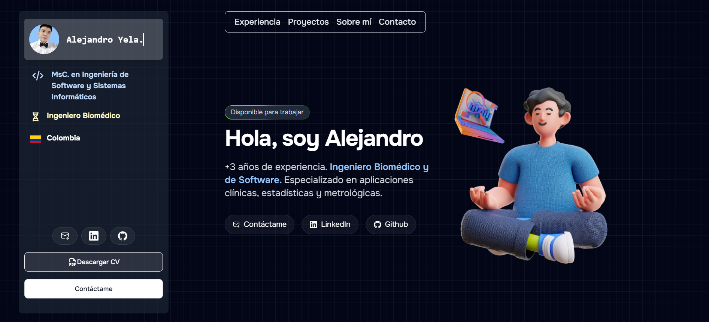
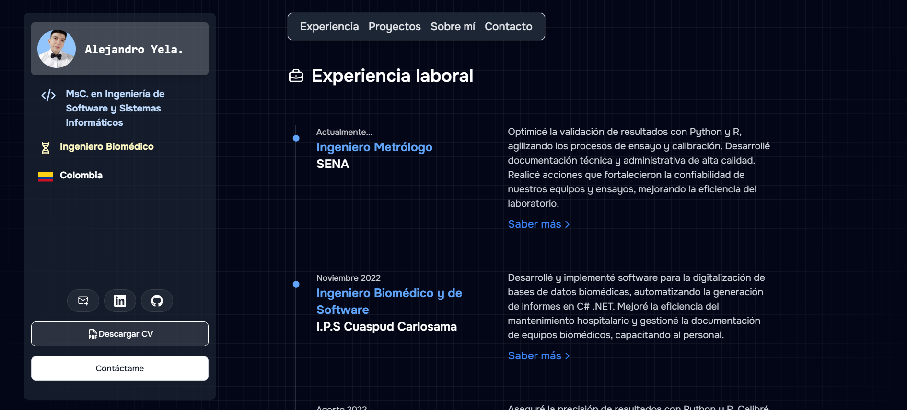
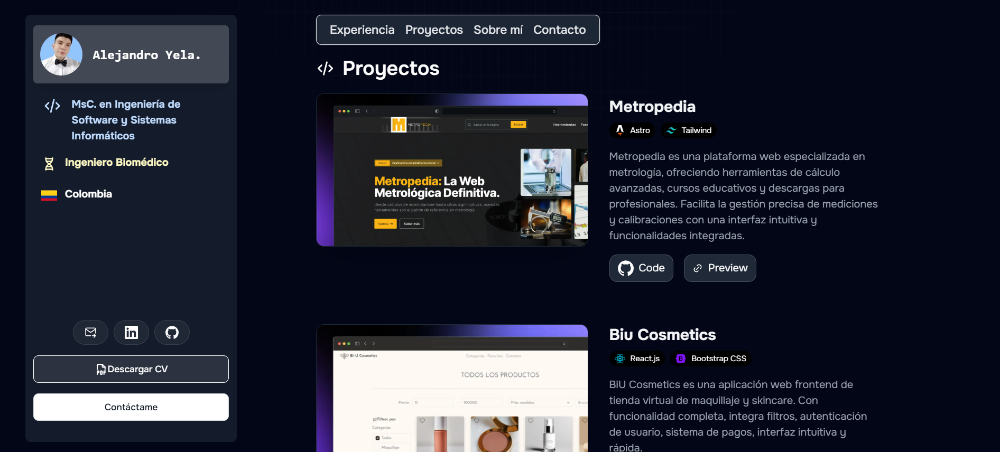
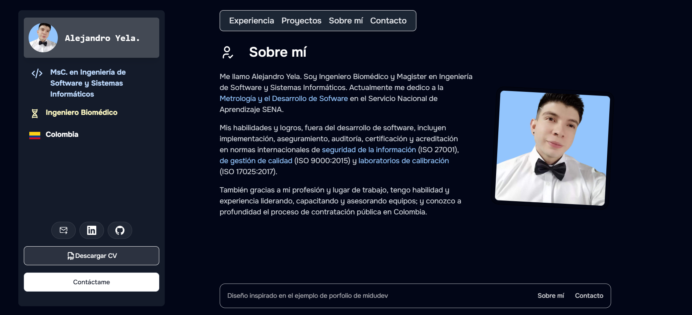

# Portafolio Web de Alejandro Yela

Bienvenido al repositorio de mi portafolio web, creado con **Astro** y **Tailwind CSS**. Este sitio presenta mi perfil profesional, experiencia, proyectos y habilidades como ingeniero biomédico y de software especializado en aplicaciones clínicas, estadísticas y metrológicas.

## 🚀 Tecnologías y Herramientas

- **Astro**: Framework de desarrollo web estático, optimizado para rendimiento y SEO.
- **Tailwind CSS**: Framework de CSS para diseño responsivo y estilizado sencillo.
- **JavaScript**: Desarrollo dinámico y modular de la funcionalidad.

## 🎨 Diseño

El diseño del portafolio está inspirado en el ejemplo de portafolio de **midudev**, con personalizaciones para destacar mi experiencia en el área biomédica y de software. Está dividido en secciones clave como **Experiencia**, **Proyectos**, **Sobre mí** y **Contacto**, además de botones para descargar mi CV y acceder a LinkedIn y GitHub.

## 📋 Funcionalidades Principales

- **Sección de Experiencia Laboral**: Descripciones detalladas de mis cargos y logros en ingeniería biomédica y software.
- **Portafolio de Proyectos**: Muestra una variedad de proyectos que incluyen aplicaciones para gestión de documentación biomédica, plataformas de venta en línea, y aplicaciones metrológicas.
- **Contactos y Enlaces Sociales**: Con accesos directos a LinkedIn, GitHub y opciones de contacto.
- **Descarga de CV**: Funcionalidad para obtener mi currículum en formato PDF.

## 📂 Estructura del Proyecto

```plaintext
astro 
├── .vscode
├── node_modules
├── public
│   ├── images
│   │   ├── 12.png
│   │   ├── 14.png
│   │   ├── 15.png
│   │   ├── foto-aayb.png
│   │   ├── meditating.png
│   │   ├── standing.png
│   ├── projects
│   │   ├── api.webp
│   │   ├── biu.webp
│   │   ├── gdb.webp
│   │   ├── rym.webp
│   │   ├── sst.webp
│   ├── CV Alejandro Yela.pdf
│   ├── favicon.svg
├── src
│   ├── components
│   │   ├── AboutMe.astro
│   │   ├── Badge.astro
│   │   ├── Experience.astro
│   │   ├── Experienceltem.astro
│   │   ├── Footer.astro
│   │   ├── Header.astro
│   │   ├── Hero.astro
│   │   ├── LinkButton.astro
│   │   ├── Linklnline.astro
│   │   ├── Projects.astro
│   │   ├── SectionContainer.astro
│   │   ├── Sidebar.astro
│   │   ├── SocialPill.astro
│   ├── icons
│   │   ├── Bootstraplcon.astro
│   │   ├── BriefCaselcon.astro
│   │   ├── Codelcon.astro
│   │   ├── Colombialcon.astro
│   │   ├── CSharpIcon.astro
│   │   ├── Dnalcon.astro
│   │   ├── Expresslcon.astro
│   │   ├── Githublcon.astro
│   │   ├── Linkedlnlcon.astro
│   │   ├── Linklcon.astro
│   │   ├── Maillcon.astro
│   │   ├── Moonlcon.astro
│   │   ├── Nodelcon.astro
│   │   ├── Pdflcon.astro
│   │   ├── ProfileChecklcon.astro
│   │   ├── Reactlcon.astro
│   │   ├── Sunlcon.astro
│   │   ├── Systemlcon.astro
│   ├── layouts
│   │   ├── Layout.astro
│   ├── pages
│   │   ├── index.astro
├── env.d.ts
├── .gitignore
├── astro.config.mjs
├── bun.lockb
├── package-lock.json
├── package.json
├── README.md
└── tailwind.config.mjs
└── tsconfig.json
```

## 🖼️ Imágenes del Proyecto

Aquí se muestran algunas imágenes de la interfaz del portafolio:

- 
- 
- 
- 

## 🔗 Estado en Netlify

El portafolio está desplegado en Netlify. Estado actual:

[](https://app.netlify.com/sites/porfolio-alejoyela/deploys)

## ⚙️ Requisitos Previos

- **Node.js** (v14+)
- **npm** o **yarn** para gestionar paquetes.

## 🚀 Instrucciones para Instalar y Ejecutar

1. **Clona el repositorio**:
   ```bash
   git clone https://github.com/tuusuario/portafolio-web.git
   cd portafolio-web
   ```

2. **Instala las dependencias**:
   ```bash
   npm install
   # o
   yarn install
   ```

3. **Inicia el servidor de desarrollo**:
   ```bash
   npm run dev
   # o
   yarn dev
   ```

4. **Abre en el navegador**:
   Navega a `http://localhost:3000` para ver el portafolio en funcionamiento.

## 📄 Licencia

Este proyecto está licenciado bajo la Licencia MIT - puedes consultar los términos completos en el archivo `LICENSE.md`.

---

¡Gracias por visitar mi portafolio! Si tienes alguna pregunta o deseas contactarme, no dudes en hacerlo a través de la sección de **Contacto** en el sitio o mediante LinkedIn.
